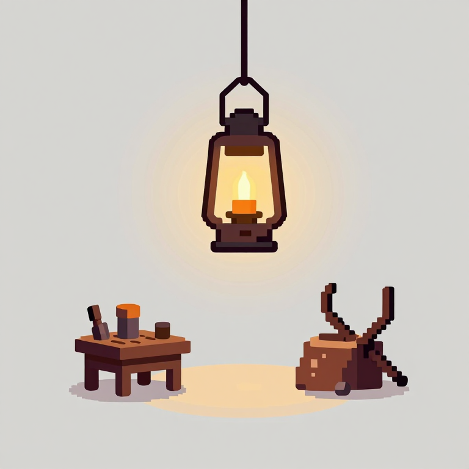

# props/ — 世界里的物件

工坊里摆放的家具与装饰。**需要透明底**(生成时用平灰底,再 alpha 抠图)。
- `furniture/` — 工人会用/交互的大件(工作台、凳子、书架、账本、门)
- `decor/` — 氛围装饰(壁炉、灯、蜡烛、地毯、箭靶、箭桶、药水架、公告板)

> 风格基准见 [`../README.md`](../README.md)。独立道具统一追加:`a single <对象> centered on a flat plain light-grey background, no scene, soft, no text`。
> 多帧动画(壁炉)做成**横向条带**,每帧等宽。
> ⚠️ **抠图经验(重要,实测踩坑)**:
> - **扁平 2D 美术别用神经抠图(BiRefNet)**——它是给真实照片做分割的,对扁平像素/插画会把整张当前景(实测背景 alpha~254、根本没抠掉)。
> - **正路 = 纯色底 + color-key**:提示词加 `on a solid uniform magenta background`,用 `comfy.py t2i … --keyflat`(或 `scripts/post/keyflat.py`)洪水填充抠底→干净透明。`anvil.png` 就是这么来的。
> - **加颜色词**防止主体过曝发白(写 `clearly coloured dark iron / brown wood`,别只说 cozy)。
> - Z-Image 偶尔补杂物 → 加 `nothing else`;纯色底让 color-key 容易兜掉。

## furniture/ 状态表

| 资源 | 文件 | 用途 | 状态 | 预览 |
|------|------|------|------|------|
| 工作台+凳子(等距) | `furniture/workbench.png` | 每个工人的工位 | ⬜ | — |
| 凳子 | `furniture/stool.png` | 备用座位 | ⬜ | — |
| 书架(档案柜) | `furniture/bookshelf.png` | 书架=档案入口 | ⬜ | — |
| 翻开的账本 | `furniture/ledger-book.png` | 账本=设置入口 | ⬜ | — |
| 木门 | `furniture/door.png` | 门=项目管理入口 | ⬜ | — |

## decor/ 状态表

| 资源 | 文件 | 用途 | 状态 | 预览 |
|------|------|------|------|------|
| 壁炉(4 帧火焰条带) | `decor/fireplace.png` | 预算电力槽 | ⬜ | — |
| 挂灯笼 | `decor/lantern.png` | 氛围光 | 🔁 |  |
| 铁砧 | `decor/anvil.png` | 工坊装饰(**color-key 透明素材**:t2i 纯洋红底 + keyflat 抠底) | ✅ |  |
| 蜡烛 | `decor/candle_00001_.png` | 桌上点缀(color-key 透明,t2i --keyflat 一条命令) | ✅ |  |
| 圆地毯 | `decor/rug.png` | 地面 | ⬜ | — |
| 箭靶 | `decor/target.png` | 墙面装饰 | ⬜ | — |
| 箭桶(成捆的箭) | `decor/arrow-barrel.png` | 角落点缀 | ⬜ | — |
| 药水架 | `decor/potion-shelf.png` | 墙面装饰 | ⬜ | — |
| 公告板(软木) | `decor/notice-board.png` | 公告板=任务入口 | ⬜ | — |

## 提示词(节选;每条都前置风格基准)

**furniture/workbench**
```
A single cozy 16-bit pixel art wooden workbench with a stool and a small rug, a candle and a few archer's tools on top, isometric 3/4 view, warm wood tones, centered on a flat plain light-grey background, soft, no text.
```
**furniture/bookshelf**
```
A single cozy 16-bit pixel art tall wooden bookshelf filled with leather books, scrolls and quivers of arrows, warm wood tones, front view, centered on a flat plain light-grey background, soft, no text.
```
**furniture/ledger-book**
```
A single cozy 16-bit pixel art open leather ledger book with parchment pages and a quill, warm tones, top-down 3/4 view, centered on a flat plain light-grey background, soft, no text.
```
**decor/fireplace**(4 帧火焰)
```
A cozy 16-bit pixel art stone fireplace with a warm crackling fire, four-frame horizontal animation strip of the flames flickering, warm amber glow, each frame identical framing, centered on a flat plain dark background, no text.
```
**decor/notice-board**
```
A single cozy 16-bit pixel art wooden cork notice board with a few pinned parchment notes and red pushpins, warm tones, front view, centered on a flat plain light-grey background, soft, no text.
```

> 其余道具按上面句式套写(换对象 + 视角)。生成后补全提示词到本表下方。

## 集成

抠图后接入 `frontend/public/props/`,在 `HallScene`/`PreloaderScene` 注册。火焰条带按 `slice_assets.py` 的 `fire` 处理。
