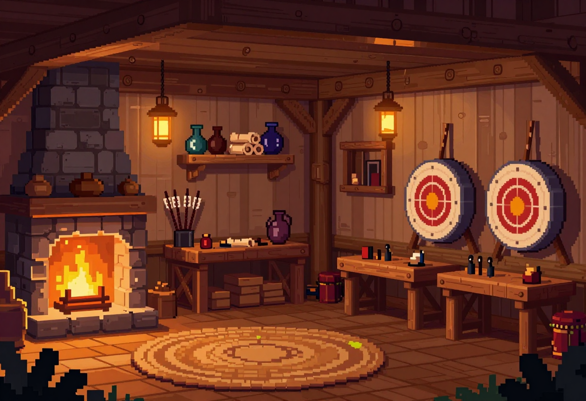

# scenes/ — 场景 / 房间背景

全屏 Phaser 世界的底图。**宽幅、无人物、无文字**;接入 `frontend/public/bg/`。

> 风格基准见 [`../README.md`](../README.md#-风格基准style-bible所有提示词都隐含这一段)。场景类统一追加:`wide interior composition, no characters, no people, no text`。

## 状态表

| 资源 | 文件 | 规格 | 状态 | 预览 |
|------|------|------|------|------|
| 工坊主场景(点亮) | `workshop-hall.png` | 1216×832 | ✅ |  |
| 工坊主场景(冷暗 / 空态) | `workshop-hall-empty.png` | 1216×832 | ⬜ | — |
| 工坊主场景(深夜) | `workshop-hall-night.png` | 1216×832 | ⬜ | — |
| 启动 / 标题背景 | `title-splash.png` | 1280×800 | ⬜ | — |

## 提示词

**workshop-hall**(✅ 已生成,seed 7)
```
A cozy 16-bit pixel art interior of a fantasy archer's guild workshop at dusk, warm and inviting. A glowing stone fireplace on the left casting warm amber light, timber plank walls and a wooden plank floor, wooden shelves holding potions, scrolls and bundles of arrows, hanging lanterns, a round woven rug on the floor, round archery targets mounted on the right wall, sturdy wooden workbenches with small tools. Warm amber and brown palette, soft glowing lamplight, calm evening cozy atmosphere. Detailed crisp pixel art, wide horizontal composition, no characters, no people, no text.
```

**workshop-hall-empty**(冷暗空态:未选项目时用)
```
The same cozy 16-bit pixel art archer's guild workshop interior, but cold and quiet at night with the fire banked to dim embers, lanterns dark, cool blue moonlight through a window, nobody home, a lonely calm mood. Muted cool palette with faint warm ember glow. Detailed crisp pixel art, wide horizontal composition, no characters, no people, no text.
```

**workshop-hall-night**(深夜变体,主题切换用)
```
The same cozy 16-bit pixel art archer's guild workshop interior at deep night, fireplace glowing low and warm, lanterns lit softly, deep indigo shadows, intimate late-night working mood. Warm amber light against deep blue shadow. Detailed crisp pixel art, wide horizontal composition, no characters, no people, no text.
```

**title-splash**(标题/启动)
```
A cozy 16-bit pixel art wide establishing shot of a fantasy archer's guild workshop glowing warmly at dusk, seen slightly from outside through a big window or doorway, inviting golden light spilling out, a crescent moon and a few stars in a deep indigo sky. Room for a title. Warm amber and indigo palette. Detailed crisp pixel art, no characters, no text.
```

## 集成

主场景接入 `frontend/public/bg/room.png`(`scripts/slice_assets.py` 会半分辨率处理)。
⚠️ **换背景要重调 `HallScene` 的地板线 + 热点坐标**(壁炉/公告板/书架/门),否则热点指空、小人浮空。
