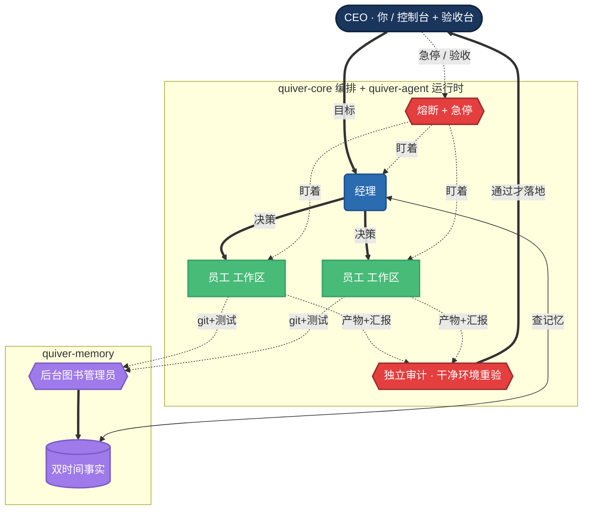

# Quiver 自治 AI 组织 · 架构蓝图 v4

> 状态：**完整蓝图 / 持续评审中**。目标：把 Quiver 做成**世界级开源的自主智能体系统**——
> 你是 CEO，一群有持久记忆的 AI 经理替你管一群 AI 员工，把软件项目自己推进下去。
>
> **这份文档分两半**：
> - **甲部 · 机房**（§3–§9）：这家公司怎么运转、崩了怎么活。
> - **乙部 · 给人用的那半栋楼**（§10–§19）：你怎么看、怎么判、怎么撤、怎么开张、怎么测、怎么拥有数据。
>
> v4 相对 v3：① 修掉三审挖出的两个致命洞（记忆"已验证"档无法到达、崩溃恢复去重钥匙用错）+ 一批安全洞；
> ② 新增「**Agent 运行时层**」（纯 Rust 自建，用足 `claude` 引擎的全部能力）；
> ③ **补全乙部 10 个房间**（v3 只画了机房）；④ 几段最绕的用大白话重写；⑤ 改对 embedding。
> 全部来自**四轮、共 20 个评审智能体**（§25）。v4.1 补丁并入四审关键修正(去重序号原子分配、合并钉对基准、可信度授予不交给 AI、状态顶替事务顺序、无进展判定、agent 运行时实测校正、几处大白话)。

---

## 0. 一分钟看懂

- **你 = CEO**，下目标。**经理**（能持续也能重开的 AI 会话）拆活、决定派几个**员工**（一次性 AI，关在独立 git 工作区里改代码）、收进度、判完成、交付给你。
- **思考全程用订阅版 `claude` 引擎**（自 2026-06-15 起，agent 用量走单独的月度额度，不挤占你平时聊天）；千问只用来做向量检索（可换本地、可插拔）。
- **整个程序是一个纯 Rust 本地应用（一个 `.app`）**：agent 运行、编排、监督、记忆、调度、界面全在一个进程。
- **安全底线**：`main` 永不坏，且由**独立审计**裁定，不由生产者。经理能拍板，但**合并/删除/写记忆这类危险操作一律 Rust 执行,AI 碰不到**——所以"信任经理"= 让它自由规划，不是把方向盘交给它。
- **记忆以 git 提交 + 测试结果为准**，不以聊天叙述为准；冲突不删旧的、只标失效；会话重开不失忆。

---

## 0.5 定位与设计哲学

**做的是什么**：不是又一个会写代码的 agent（那个早做烂了），而是**一家能自己运转、能被人看着管、能存活和复活的 AI 公司**。

**三个别人没占住的护城河**：
1. **组织是一份持久、可审计、能崩溃恢复的数据**（别人是临时的、跟终端绑死、关掉就没）。
2. **像素办公室是给非工程师 CEO 的实时操作台**（每个手势=一次真实操作，不是事后看图）。
3. **设计成在订阅额度里也能跑**（把额度当要规划的资源）。

**五条设计哲学**（贯穿全文）：
- **蓝图完整，施工渐进**：本文画全貌，§23 分阶段盖。
- **危险操作不交给 AI**：AI 出主意，Rust 执行后果。
- **以产物为准，不以叙述为准**：git/测试/diff 是真值，AI 说了啥是线索。
- **AI 能否决、不能推翻；Rust 算结论、AI 不能设**（安全核心姿态，§8）。
- **每个机制都要能落地**：不留"以后想办法"的口号。

---

## 1. 与 DESIGN §7 的关系

老规矩 `DESIGN §7`：合并遇冲突绝不让 AI 自动解决，停下等人。自治版**改"谁拍板"、不改"什么算安全"**：

| §7 老规矩 | 自治版 |
|---|---|
| 冲突/红 → 等人 | → 等经理拍板（可派员工重做），但裁判是下一条 |
| `main` 永不坏 | **不变（铁律）**，裁判换成"**独立审计在干净环境重新验过 + 确认测试没被偷偷改弱**" |
| 合并前跑测试 | 不变，但"绿"只是必要、不充分（员工可能把测试改水，§8.1） |
| 工作区隔离 | 不变，且老沙箱规矩继承到每个节点 |

---

## 2. 我们参考了谁（精简）

Anthropic《构建高效 Agent》《多 agent 研究系统》《上下文工程》《沙箱》；Claude Code Agent Teams（数据模型，不当运行时）；MetaGPT/ChatDev（角色划分）；LangGraph（递归监督树、记忆分层）；MemGPT/Letta（分层 context、后台整理）；Mem0（混合检索）；Zep（双时间、失效不删）；Generative Agents（反思、三因子检索）；DBOS/Temporal（持久执行、版本钉住）；Erlang/OTP（监督重启）；Meta Rule of Two（权能分权）。完整链接见 §26。

---

# 甲部 · 机房

## 3. 总体架构（纯 Rust 单二进制）

**一句话**：一个 Rust 程序（一个 `.app`），agent 运行、编排、监督、记忆、调度全在进程内；每个 AI 是 `claude` 引擎的一个子进程；组织是 SQLite 里的一棵递归树。

**代码模块**：
```
quiver-app   (Tauri)    界面 / 像素控制台 / 急停 / 验收台(乙部)
quiver-core             编排循环：崩溃恢复、异步事件、监督重启、独立审计、合并、成本治理、回滚
quiver-agent (新)       Agent 运行时层（§4）：纯 Rust 包一薄层驱动 claude 引擎,用足全部能力
quiver-store (rusqlite) 任务板 + 崩溃恢复日志 + 角色/节点 + 审计日志(乙部) + refinery 迁移  ← 唯一权威
quiver-memory (新)      四类记忆：SQLite(FTS5)+sqlite-vec + 千问 embedding + 混合检索 + 后台整理
                        └─ rmcp MCP 服务：把记忆工具开放给 agent；编排器进程内直调
```
数据放 `~/Library/Application Support/Quiver/`：`orchestration.db`（**唯一操作真值**）、`memory.db`（回忆，可重建，不参与当下决策）、`worktrees/`（**放仓库外**）、`cache/`、`exports/`（乙部）。

**节点类型**（都是 `claude` 引擎实例，区别在配置和权限）：经理（规划，没有手）、员工（改代码，关工作区，无合并/无写记忆权）、审计（Rust 拥有，干净环境重验）、图书管理员（后台整理记忆）、子经理。**危险操作永远 Rust 执行。**



---

## 4. Agent 运行时层 `quiver-agent`（我们自己的纯 Rust Agent SDK）

官方 Agent SDK 只有 Python/TS，没官方 Rust 版。我们定了纯 Rust 单体，所以**自己在 Rust 里包一薄层**，直接驱动 `claude` 引擎，但**用足它的全部能力**（这些能力是引擎本身就有的，命令行/配置都能调到，只是我们用 Rust 编程地调）：

| SDK 能力 | 我们怎么在纯 Rust 里拿到 |
|---|---|
| 会话续接 | `--resume <会话ID>`（会话 ID 必须从输出里抓下来存库，见 §5.3 修的洞） |
| 结构化输出 | `--output-format stream-json` + `--json-schema`（四审实测:引擎现在会自己重试纠正,不再"必畸形";只需兜住一个终态错误,见 §5.5）|
| 自定义工具 | 我们自己的 `rmcp` MCP 服务 + `--mcp-config`（记忆工具、org 状态工具…） |
| 子 agent | `--agents` 定义角色;但**引擎的子 agent 不能再套子 agent**,所以"经理派子经理"走的是**我们 Rust 再起一个顶层 `claude` 进程**(递归在 Quiver 的树里,不在引擎的 `--agents` 里);`--agents` 只用于节点内的小助手 |
| 权限控制 | `--permission-mode` + 一个"权限询问工具"（MCP）把放行/拒绝接到 Rust 回调（四审实测 `--permission-prompt-tool` 真能接到 Rust）|
| hooks（动作前后插钩子） | 每次运行单独传(`--settings` 的 JSON 或 `--agents` 内联 hooks)——四审实测能拦住工具调用,不必只靠配置文件;用它做质量闸/进度采集 |

**抽象成一个接口**：`quiver-agent` 暴露一个 `AgentRuntime` trait（`spawn / resume / stream_events / cancel / set_permission`,工具和 hooks 作为启动参数 `SpawnConfig` 传入)。第一版用上面这套"驱动 claude 引擎"的 Rust 实现；**以后想换 Node 边车跑官方 SDK,换一个 trait 实现即可**。诚实说明(四审):这层只隔离了"进程生命周期";会话续接、结构化输出、出网转发这些**与 Anthropic 命令行/线格式绑定的细节会从缝里漏出来**(见 §5.3/§5.5/§8.3),换边车时这几处要重写——但核心上层不动。**事件流要定义成与引擎无关的 `AgentEvent` 枚举**(现有 `parse.rs→adapter.rs` 那层归一化就是这个缝),trait 才真能换。

**额度（好消息）**：2026-06-15 起，订阅版上 agent / `claude -p` 用量走**单独的月度 Agent SDK 额度**，和你交互聊天的额度分开算——agent 整夜干活不挤占你平时用量。这进一步弱化了"额度焦虑"（§9 仍把成本治理设计进去做稳健性）。

---

## 5. 编排与控制循环

> 核心：**只有一个地方算"这步真做完了"——orchestration.db 写日志那一刻。** 别的副作用（起进程、git 提交、写记忆）都挂它后面，且都能安全重复执行。

### 5.1 两本账：记账 vs 回忆（先讲清这个,后面好懂）

**记账（orchestration.db）管"当下"**：谁在干活、哪个活在跑、该不该再派——必须准、必须实时，所以**所有决策只读它，且同步读**。
**回忆（memory.db）管"知识"**：这项目以前怎么回事——可以慢、偶尔对不上、丢了能重建，**但绝不拿来判断当下该派谁**。
两本账分开，是整套崩溃恢复和防错的地基。

### 5.2 崩溃恢复 + 去重钥匙（修三审的致命洞）

每个编排步先在 `saga_step` 登记一条日志（这是唯一提交点），副作用挂后面、都能重复执行；崩溃重启时跑"对账"，去现实里查实际状态。

**去重钥匙(idempotency key)——三审发现 v3 用错了，必须修**：v3 用"决策内容的哈希"当钥匙，这分不清两种情况:
- "同一个决定崩溃后重放"（该跳过）
- "两个长得一模一样的真决定"（比如重试同一个失败任务、派两个一样的员工、定时刷记忆）——**会被当成重复悄悄吞掉 → 经理干等永不到来的回复 → 卡死**。

修法:**钥匙 = (节点ID + 这是该节点第几次决定的序号 + 内容)**。**序号必须和写日志在同一笔数据库事务里分配(一次提交)**——四审发现:先自增序号、再单独写日志,崩在中间会烧掉一个序号却没有对应日志,那个决定被永久跳过、又变回卡死。同一笔提交后:崩在中间→序号和日志都不存在→重放重新分到同一个序号→正确跳过或重做。内容哈希降级为"重放时校验内容一致"的护栏。

**对账要能判定，不能靠 `kill -0`（三审发现也不可靠）**：PID 会被系统回收给别的进程，`kill -0` 探到的"活着"可能是无关进程。改用**栅栏令牌**:启动员工时记下 `(PID + 进程启动时间 + 写进工作区的一个随机 run-id 文件)`，三者都对上才算"还是它活着"。再要求**员工退出前写一个"我干完了"的标记**(幂等)——于是对账变成可判定的:活着(栅栏对上)→接管;死了+有标记→标记完成;死了+无标记→`git reset` 到工作区 HEAD 重起。

### 5.3 会话与检查点（修一个真实代码洞）

**现状洞**:`runner/claude/adapter.rs:41` 把会话 ID 解析出来后**直接扔了**,且从不传 `--resume`。所以"崩了接着跑"这根线现在不存在,P0 第一步就补:把会话 ID 一路存进 `agent_node`。

**两条恢复线分清**:git 工作区 HEAD(代码,靠心跳 `git commit`)、`claude --resume`(对话)。规则**git HEAD 为准**:重起先 `git reset --hard <HEAD>`,对话用简报重新播种(不用 `--resume`,重放长对话最贵)。

### 5.4 监督与重启（OTP 那套）

重启类型(总是/异常时/不重启)、同级策略(一个挂了牵连谁)、重启风暴熔断(一分钟超 N 次→子树自杀升级)。**不再用"已完成到第 K 步"这种说法**(三审:自由编码没有清晰"第 K 步",且和"HEAD 为准"打架)——改成**按状态续**:把"已提交的改动 vs 任务起点的 diff"+ 原始任务给重起的员工,让它读着这个 diff 自己接着干。要更强保证就把任务拆成 Rust 派的子任务(那"第几步"才是真的)。

### 5.5 超时、心跳、进展（修"无进展"误判）

墙上时钟死线 + 心跳(解析事件流)。但**"活着"≠"在进展"**:一个 AI 可能原地打转,事件流不断。三审又指出 v3 的"无进展=连续 N 次心跳零 git 改动"会**误杀正经的慢活**(读代码/跑长测试时本就没改动)。修法:**只在"零改动 + 事件签名在重复"(反复读同一文件/反复跑同一失败测试)时才判无进展**,且第一窗口给足宽限。计数**只在"真有进展"时重置**——新提交、新测试结果、新 episode;**不能因为"碰了个新文件"就重置**(四审发现:每次心跳 touch 一个新空文件就能永远骗过它)。光碰新文件不提交,本身算无进展。

### 5.6 异步事件循环 + 注入"在跑的活"（控制大小 + 不毁缓存）

经理绝不卡等员工:出一次决策→退出;员工有动静→唤醒经理。唤醒时注入两样:**简报+相关记忆**(知识,可总结)和**当前实时状态块**(操作真值:未回的派活/审计中/未读信箱,从 orchestration.db 精确实时拼,绝不走会丢信息的记忆整理)。

三审提醒:实时状态块会随在跑的活变多而**变大、且每次都变→毁掉提示词缓存**。修法:① 状态块**封顶**(只列最相关的几条,其余折成"还有 12 项,需要时调 `org.inflight()` 查"工具);② 所有易变内容(状态块+再注入的事实)**放提示词末尾**,稳定前缀(人设/项目简报)放前面别动,缓存才不失效。

### 5.7 合并列车（异步干活、串行落地、防作弊、别成瓶颈）

员工完全异步各干各的。到 `main` 的合并排成单线列车,一次一个:
1. **审计在干净克隆、指定提交号**上重验(§8.1);
2. 合并用**那个确切提交号**(`git merge <sha>` 不是分支名),且断言两件事:**审计的提交号 == 实际合并的**(堵"审计后又偷塞"),**且审计时基于的 `main` == 现在的 `main`**——四审发现只钉前者不够:并行审计时 B 在 `main@T1` 上审过,A 先合进去把 `main` 推到 T2,B 还绿着合到了它没审过的 T2 上。`main` 一动就重审(那一个上车串行审),别只靠合并后重跑普通测试(它不重跑对抗式审计);
3. 合并后对新 `main` 重跑测试 + 重跑"测试有没有被改弱"检查;红→回滚等人工。

三审两个修正:
- **"可疑才全量重验"里的"可疑"必须是一条明确的 Rust 规则**,不是凭感觉:命中{来源不可信/动了安全·构建·CI·依赖文件/diff 超过阈值/这分支之前审计失败过/改动代码没有在干净环境跑过的覆盖测试}任一→全量;否则走快路。**但"在干净克隆真跑一遍测试"永远必做**(这才是 I1 的安全本体),可跳的只是那个更贵的"对抗式 AI 审计"。
- **别让列车成吞吐瓶颈**:N 个员工同时完工时,**审计可以并行**(各审各的,不上车),列车只串行做"合并 + 合并后重验"。把 `N×(克隆+审计+验)` 压成 `max(审计) + N×(合并+重验)`。

### 5.8 升级阶梯 + 保证停下来（修终止性漏洞）

出问题往上递,最终到 CEO。三审指出 v3 的"升级扣预算所以会停"证明有漏:有些循环(被去重吞掉的重试、派活↔刷记忆震荡)**根本不扣预算**,且预算若能退还就不单调。修法:**每做一个决定都扣一点钱(决策税),而且这钱只出不进**(不只升级时扣)。所以不管 AI 怎么原地绕圈,钱包总会见底、一见底强制停——不会有永远停不下来的循环;另加"升级风暴熔断"。再单独给**每个任务留一份最低预算**,防一个吵闹子树把兄弟任务的钱耗光(饿死)。

---

## 6. 记忆引擎 `quiver-memory`

> 原则:**以 git+测试为准、不蒸馏聊天;冲突不删只标失效;混合检索;会话重开不失忆;不可信来源隔离。**

### 6.1 四类记忆

工作(会话本身,易失)、情景(`episode`,**绑提交号+测试结果+diff**)、语义(`memory_fact`,**双时间、只追加、带可信度**)、程序(角色配置+`CLAUDE.md`)。

### 6.2 信任档（修三审第一致命洞 + 集中讲清）

三审发现 v3 在三处对"图书管理员产出的事实算什么可信度"自相矛盾,且**修完后没有任何记忆能自动到达"已验证"档**——而经理日常查的就是这层,等于"以测试为准"是空的。

**v4 定死一张表(可信度档只此一处讲,别处别再各说各话)**。注意:这里的"**可信度**"是**记忆条目**的属性,跟前面"信任经理"那个"信任"(经理的**规划自由度**)是两码事、别混——铁律和数据库里把这一列叫 credibility/可信度:

| 谁写的 / 怎么来的 | 可信度档 | 能不能作废别人 / 能不能被自动塞进经理 |
|---|---|---|
| CEO 确认 | `权威` | 能作废任何;能 |
| **机器直接算出来的**(提交号、diff 行数、还有"这模块现在是什么状态"这种只会往新的盖、不回退的记录——全程没 AI 插手) | `已验证·机械` | 能作废同模块旧的同类;能 |
| **两次独立绿测试都印证**(Rust 算出来,见下) | `已验证·印证` | 能作废低档的;能 |
| 图书管理员对 diff 的**自然语言提炼** | `员工汇报` | 只能给高档打标记、不能作废;能(但排序靠后) |
| 员工写的(进待审区) | `不可信` | 不能;**不能自动塞**,要经理主动查才以"未核实"出现 |

**"已验证·印证"怎么自动产生(补上 v3 缺的升级动作)**:四审发现 v3 这里有坑——"判 diff 是否印证某条事实"本质是 AI 在判,等于 AI 又偷偷回来设可信度了。修正:**自动升档只认纯机械印证**——同一条断言在**两次独立提交**上都被绿测试覆盖通过(纯机械、无 AI 语义判断),Rust 就把对应事实升到 `已验证·印证`、并记下**这组印证 episode 的集合**(记集合不记计数,重放才幂等)。要靠 AI 语义判断的"印证",**只能解锁一个待 CEO 确认的标记,绝不自动授予**。原则:**AI 拥有的是否决、不是授予;Rust 拥有的是决定、不只是写入。** 这样"已验证"档有了自动到达的路、且 AI 碰不到授予,"你毒不了绿测试"才真成立。

### 6.3 双时间、只追加（Zep）

```
memory_fact: text, entities[], importance
  valid_at / invalid_at        现实里何时成立/失效（失效≠删）
  recorded_at / retired_at      我们何时记下/撤下
  superseded_by                 被哪条新事实顶替
  invalidated_by_episode        或被哪次合并/测试判失效（链条终止到那次合并）
  provenance / trust            来源 / 可信度档（§6.2 表）
  embed_model / embed_dim       用哪个模型几维（换模型时知道哪些要重算）
  source_commit / source_episode_id
```
查当前真相=`invalid_at IS NULL`;查历史=顺 `superseded_by`。**永不 DELETE。**

### 6.4 失效与状态派生（修"漏判"和"竞态"）

**作废是图书管理员的明确步骤,不是自动发生**:绿合并→产新事实(`员工汇报`档)→挑候选→一次 AI 调用判矛盾→顶替。两个三审修正:
- **候选别只按"碰同一个东西"挑**(改名会让实体词变了→真正矛盾的那条因重合度低掉出候选→陈旧事实永远活着)。改成**向量+关键词+实体三者混合挑候选**,再加一个**后台慢扫**:定期把"提交号已远落后于 `main`"的事实拿来对当前代码复检,兜住快路漏掉的。
- 候选只是**框成本**,不是判定依据;判定只看 diff 内容是否真矛盾。

**"模块现在啥状态"**:图书管理员每次合并涉及某模块时生成一条 `状态`事实(`已验证·机械`档)、单调顶替上一条。三审修正:① **按合并列车序号排序**(不按图书管理员的墙上时钟,否则会用旧的顶替新的);② **图书管理员单线跑**(别两个实例同时改,否则出两条"当前状态");③ 数据库层面加一条硬规则:同一模块、任何时刻只能有一条"当前状态"生效(多了被数据库拒绝)。**因为是只追加,顶替必须在一笔事务里"先把旧的标失效、再插新的"**(顺序反了会同时两条生效被拒);且图书管理员遇到**比当前那条更旧的合并序号要直接跳过**(序号规则+这条硬规则合起来才挡得住陈旧顶替)。索引细节见 §20。

**区分两种"状态"**(三审 C2):这条 `状态`事实是**内容态**(这模块当前用了什么方案,供经理理解代码),**不是操作态**;"这模块有没有活在跑"仍只读 orchestration.db(§5.1),两者别混,内容态绝不进派活决策。

### 6.5 实体词表 + 路径对照（修"无人维护会烂"）

只有图书管理员维护一张项目级**受控实体名单**(写入归一化别名);查询时把查询词模糊匹配到名单。`entity → 路径`对照表三审指出会随代码搬家烂掉——改成**从最近若干 episode 实际碰过的路径反推**(数据驱动、自愈),并对"一次合并碰的路径映射到零个实体"报警(说明名单该补了)。

### 6.6 混合检索 + embedding 生命周期（含 embedding 更正）

```
得分 = w_vec·向量相似(千问) + w_bm25·关键词(FTS5) + w_entity·实体重合
     + w_recency·valid_at新鲜度 + w_importance·重要度 + w_trust·可信度
     − 惩罚(已失效 | 不可信)  → 取前 k
```
权重先用固定常量(没评测集前别乱调);**冷启动**(库空)直接返回所有当前可信事实;**索引**别忘 `(project,scope,kind,invalid_at)` 和 `superseded_by`;只追加→FTS 只需插入触发器。

**embedding 更正(三审)**:用千问 **`text-embedding-v2`,固定 1536 维**——它**不收 `dimensions` 参数**(我之前让你钉死是错的)。`dimensions` 是 v3/v4 才有、且默认 1024。所以:v2 直接用、不传参;**只有以后换 v3/v4 才必须传 1536**,否则它给 1024、对不上 `FLOAT[1536]` 列。换模型重算时:写**影子向量表→原子切换**(别中途半新半旧不可比),且 embedding 调用**分批≤10 条 + 429 退避**,这层在 Rust 里(§8 出网在 Rust)。

### 6.7 后台图书管理员（独立、从产物蒸馏、限频）

触发(会话快满/里程碑/定时,限频、不上关键路径)→独立 AI 读 **episode+diff+测试结果**(不是聊天)→提炼→巩固→**交回 Rust 做 embedding+写库**(图书管理员只产文本、不出网,符合 §8 的 I7)。它产出的自然语言事实**只算 `员工汇报`档**(§6.2)。

### 6.8 反思 + 会话重开不失忆（修"简报抖动"）

简报**从当前事实重新生成**(不原地改、每行标依据的事实ID、依据全失效就删行)。三审修正:别用一个全局水位线触发重生成(一个忙节点会让所有简报老不停重生成),改成**只在这份简报真正用到的那几条事实变了时才重写它**——没碰到的就不重写(一个忙节点改了别的事实,不该害得所有简报都跟着重写)。会话重开=丢会话ID→新 AI→注入【小简报+前k事实+人设+实时状态块】;**易变内容放末尾抗"注意力衰减"**(长会话越往后越只看最近的)。

### 6.9 待审 + 防投毒 + 原始日志清理

员工写的进**待审区**、标不可信、**不自动塞进经理**(它是自由规划的,一条带指令的假记忆正好带偏它);提升要 CEO 确认或**新合并 diff 内容真印证**(不是"碰同一个东西"——那个攻击者能构造);可信度**Rust 算、AI 不能设**;禁 AI 删高档事实。待审区加**超时 + 一个"待审清单"工具**让经理复核(防有用事实饿死)。原始事件日志**过期归并成 episode 后可清**(区别于"事实永不删")。

---

## 7. 自治旋钮 + 权能分权

**每个 AI 可调**:权限模式、工具白/黑名单、是否计划审批、预算/轮数、树深/扇出、重启策略、有没有长期记忆、用哪个模型。

**权能分权(Rule of Two)**:员工=吃不可信输入+改自己工作区代码,但**无合并权、无写记忆权**,只交"产物引用+汇报";**合并由 Rust 在审计通过后做、写权威记忆由图书管理员从已验证 episode 出**。于是"经理自由规划"安全成立:它有脑没有手。**信任=规划自由度旋钮,不是破坏半径旋钮。**

---

## 8. 安全（沙箱是头等,现在一行没写）

**现状**:员工跑代码除了清环境变量**没有任何隔离**。下面一切建立在沙箱上,**沙箱必须最先建**(继承 `DESIGN §9`:内核 Seatbelt 失败即拒、默认禁文件、禁读密钥、出网白名单)。

### 8.1 独立审计（修"绕过测试改弱"——光对比测试文件挡不住）

审计由 Rust 拥有(经理动不了),在干净克隆、指定提交号上重验。三审指出"只对比测试/CI 文件有没有动"能被绕过(改源码让断言形同虚设、新建一个没被匹配的 `conftest.py`、改依赖锁、改构建配置让某套件不跑、让测试超时)。修法:
- **不是比文件,是验"测试这把尺子没变软"**:把 `main` 上**已知会通过的测试**拿到改后的源码上跑;再用一个"故意改坏源码"的探针确认这些断言**还能失败**(失败得了才说明断言有效)。这叫变异式验证,比对 diff 强。
- 把**构建脚本、依赖锁、CI 配置、verify 命令本身**都当"评分文件"一起硬否决,不只 `*_test.*`。
- **覆盖率/断言数下限**:比 `main` 明显掉了→可疑→全量。
- **机械检查做成 Rust 硬否决,AI 的判断只能加否决、不能推翻 Rust 的否决**。

### 8.2 沙箱要在"克隆代码之前"就位 + 堵齐自动执行口子

三审最狠的一条:恶意仓库能靠 **`.gitattributes` 的过滤器**在审计 AI **克隆/检出代码那一瞬间**就执行代码——v3 只关了 git 钩子,没关这个。还有 `build.rs`、npm/pip 安装钩子、`conftest.py`、子模块 `update=!命令`。修法:
- 克隆/检出时:`core.hooksPath=/dev/null`、**关掉属性过滤器**(`core.attributesFile=/dev/null` + 过滤器设成 `cat`)、不递归子模块、`protocol.file.allow=never`、`core.symlinks=false`。
- 对 `build.rs`/安装钩子/`conftest` 这种**没有 glob 能防**的:**唯一的防线是沙箱**——所以沙箱必须在 `git clone → checkout → build → test` 整条流水线之前就罩上(现在 `verify.rs` 直接裸 `sh -c`,没罩)。

### 8.3 员工真断网(光"没令牌"不够)

三审:员工有命令行,就算没令牌也能 DNS 隧道、借合法接口夹带、把密钥写进代码提交。修法:**员工没有任何直接联网能力**——它自己的 `claude` 请求也走一个 **Rust 本地转发器**(只放行格式正确的 Anthropic 调用),员工进程连域名解析都做不了。合并前**扫 diff 里的密钥**。文件范围**明确排除** `~/.aws`、`~/.ssh`、`~/.config/gh`、`~/.netrc`、以及 **`~/.agents/resources.json`(你那个千问 key)**。

### 8.4 急停真杀整窝（修 Mac 上杀不干净）

三审挖出代码级洞:现在 `cancel` 是 `kill -TERM <单个PID>`,没有进程组;Mac 没有 Linux 的 cgroup,员工 `setsid`/`nohup` 起的后台进程(比如正在外传的)杀不掉。修法:**启动每个员工时单独 `setsid` 关进一个进程组**;急停时 `killpg` 整组(先 `SIGSTOP` 冻结、再 `SIGKILL`);再**扫一遍后代进程**兜逃逸的;沙箱本身也禁 `setsid`/对外 fork。**先暂停再收回**(别让正在跑的命令做完才生效);危险操作本就 Rust 把关,半截的 `git push` 不该存在。

### 8.5 记忆/MCP 注入面

`memory.search` 返回的"已验证"事实文本也是 AI(图书管理员)读着可被影响的 diff 写的→可能把指令喂进自由规划的经理。修法:**一条检索到的事实永远不能单独成为 `deliver`/`spawn` 的理由**(决策的依据必须落在 orchestration.db 上,§5.1);MCP 工具描述**静态、审计过、启动时校验哈希**;`memory.write_fact` 限频去重防灌。

### 8.6 安全铁律 I1–I7（对**所有** claude 节点成立)

I1 `main` 由独立审计裁定 · I2 没有 AI 同时握三种危险能力 · I3 信任是规划旋钮不是破坏半径 · I4 记忆有可信度(Rust 算、AI 不能设;**AI 只能否决、不能授予**)、不可信隔离不自动信、AI 删不掉 · I5 AI 间消息是数据不是指令(**经理/员工/审计/图书管理员都适用**) · I6 危险操作都有自动熔断+人工急停 · **I7 沙箱+出网约束继承到每个 claude 节点**(经理/员工/审计/图书管理员出网范围都只有"经 Rust 转发的 Anthropic + 本地";embedding 调用全在 Rust,不在任何 AI 进程内)。

---

## 9. 成本治理（设计进去做稳健,不砍功能）

2026-06-15 起 agent 用量走单独月度额度,焦虑减半,但仍设计:配额感知(紧张时串行、不扇出、429 退避)、缓存优先(钉死模型/努力档、长期经理关自动升级、非写员工共享只读工作区、稳定前缀只追加)、价值闸(默认单员工,真独立且够值才多派,"加个评审 AI"便宜放行)、模型分工(经理默认 Sonnet、低置信升 Opus;别让 Haiku 做规划)、分级预算(子派活从父余额扣,**只减不退**,§5.8);每个 `claude` 进程还能 `--max-budget-usd` 设一道进程级硬上限(四审确认)。

---

# 乙部 · 给人用的那半栋楼

> 三审发现:甲部把"机房"画得极好,但"给人用的那半栋楼"几乎全空。下面把它补齐——大多是在**已有数据上加给人看的界面**,不是再造引擎。

## 10. 观测 / 复盘室（你吹"可审计",得真能审）

每个决策已是一条 `saga_step`、每个 episode 已绑提交号+测试结果——数据都在,缺的是给人看的读取面。要建:
- **因果树视图**:CEO目标→经理决策→派活→员工提交→审计裁定→合并。每个节点带:哪个 AI、决策内容+理由、花了多少、耗时、查了哪些记忆(带可信度档)、结局。
- **决策审计("它当初为啥这么干")**:决策当刻的输入快照——注入的简报、实时状态块、检索到的前 k 条事实。**注意**:因为每回合都再注入事实(§6.8),必须**逐回合记下当时注入了哪些**才能复原决策——这是新增的写需求。
- **成本/决策时间线**:一整夜的派活、升级、合并、熔断、预算燃烧。
- **回放**:① 只读重构(便宜,从日志走一遍);② 真确定性回放(把 AI 输出/工具结果用录制的桩替掉,重跑编排逻辑来 debug)——这也是 §11 测试的底座。
- **格式**:即使在 app 内渲染,也按 **OpenTelemetry GenAI 语义**发 span,未来好导出。

## 11. 测试 / 评测室（整套安全靠它证明,现在只有一个词）

"假 claude"全文只出现一次。要把它升成一等设施:
- **录制会话桩 + 确定性回放**:抓真实 `claude` 输出流(含畸形/截断),可复现重跑。一切的底座。
- **铁律 I1–I7 各配一个对抗测试**:I1→改弱测试的分支必须被否决;I2→断言没有节点同时握三权能;I4→不可信事实绝不自动注入。
- **记忆/决策评测集**(§13.5 欠的那个就是这间):检索命中率、作废正确性(矛盾合并是否正确失效旧事实?非矛盾的同模块改动是否正确**不**失效?)、投毒红队用例。
- **崩溃/混沌测试**:在每个 saga 边界 `kill -9`(写日志前后、`git push` 半截、合并半截)断言对账收敛。这是崩溃恢复这颗皇冠的证明。
- **合并列车回归**:两分支单独绿合一起红、审计后又改、检出时执行代码——安全关键,锁回归。
- **指标闸**:每 PR/每夜跑完成率、自治度、干预率,过线才合。

## 12. 第二天早上 · 验收台（这其实就是产品本身）

你 8 点醒来的界面。要建:
- **晨报**:目标→哪些合进了 `main`、哪些卡住(为什么:审计否决/冲突/预算)、哪些升级了等你、花了多少、几个值得看的决策。
- **验收队列**(§13.1 那个开放问题的答案):待你点头的交付,每个带审计裁定、diff、经理的交付说明,**接受 / 驳回 / 打回重做**。驳回要能回流进组织(派个修)。
- **人机边界策略**:哪些动作永远停下等你、哪些自动放行,做成可配置(接 §7 旋钮),每个映射到像素手势(§22)。
- **叫醒模型**:半夜哪些事 ping 你(烧到预算底线的升级该叫醒)、哪些等早上。

## 13. 整夜回滚 / 撤销（AI 整晚走错方向,怎么收）

现在只能撤单次合并。要建:
- **粒度**:撤一次合并 / 撤一个任务子树 / 撤一整夜。
- **git 语义**:用 `revert`(保留历史、不破坏 `main`,首选),不用 `reset`。定清楚和合并列车、在跑员工怎么交互。
- **记忆级联**(微妙的硬点):事实绑了提交号,撤了提交那些事实就陈旧了——把 `source_commit` 落在被撤范围里的事实**全标失效**(不删,符合 §6.3),记一条 `invalidated_by_episode` 指向这次回滚。复用现有机制。
- **命名还原点**:跑高风险任务前先打快照,撤销=恢复快照,不是事后考古。

## 14. 人事室 · 角色生命周期（开源的命脉:可分享的模板库）

`agent_role` 现在只是张配置表。要建:
- **角色编辑 UX**(人事部):建/改/克隆经理或员工人设——模型、系统提示、工具白/黑名单、预算、深度/扇出、重启策略。
- **版本化**:`agent_role` 要有版本历史(像 Claude Code 角色那样改一次+1)。给 §15 用:一个在跑/暂停的任务钉住它开始时的角色版本。
- **开源模板库**:内置起手人设(后端经理、测试员工、安全审计…)当可分享文件(markdown+配置),可导入导出。**这是开源吸引力的关键,现在完全没有。**
- **改进闭环**:把角色的产出统计(审计否决率、升级率、每任务成本——来自 §10)摆出来,让 CEO 或一个离线反思过程去精修提示。这样"角色可演进"才不是口号。

## 15. 自我升级（你吹"claude 升级了公司也活",但其实没写)

跑一半时升级 Quiver 自己再恢复旧任务,这是持久系统最难的问题(Temporal 专门做了"版本钉住")。要建:
- **运行版本钉住**:每个任务/节点记下启动时的 app+schema 版本;恢复时要么按钉住的逻辑回放、要么走明确的迁移补丁点。
- **带在途状态的 schema 迁移**:`refinery` 迁移表结构,但暂停的任务有活的 `saga_step` 行,语义可能变——定**只准加列、不准改 pending 步形状**。
- **`claude`/模型升级**:`embed_model/embed_dim` 已为换 embedding 留好(§6.6),推广到所有版本敏感状态;定清楚长期经理跨会话换规划模型时缓存/正确性怎么办。
- **能不能恢复旧任务的兼容矩阵**:哪些版本差能自动续、哪些要引导迁移、哪些不支持(且明确告诉 CEO,别悄悄跑坏)。

## 16. 开张 · 首次运行（目标用户是非工程师 CEO,这步最该好却全空）

要建:**空界面的像素办公室** + 下第一个目标的入口("雇第一个经理、给个目标");**配置清单**(连 git 仓库、配沙箱[现在还没建,开张要 gate 在它上]、给/跳过千问 key、设过夜预算);**起手人设**(从 §14 库里来,别让 CEO 第一分钟就写提示);**一个带引导的试跑**("看一个员工做一件小事、你审、你合")教会人机边界(§12);**渐进放权**(接 §22 的"先只读观测、再接可写手势")。

## 17. 多仓库公司（一个只能动一个仓库的"公司"是工具不是公司）

`episode`/`memory_fact`/`entity_path` 现在都假设单仓库(有 `project` 列但没设计)。**v1 先支持一个公司管 N 个独立仓库**(便宜,纯加作用域);**跨仓库的原子改动**(改 A 的接口同时改 B 的调用方)做成**已知限制**——明说 v1 punt 到"多个 PR 手动排序",但 schema(`entity_path` 变 `(仓库,实体)→路径`、记忆分"本仓库 / 全公司")**现在就为它留好**,免得以后大改。

## 18. v1.0 定义 / 成功指标（要有终点线和"什么算好"）

§23 有阶段没终点。要定:
- **v1.0**:够一个 CEO 跑一个真过夜任务并信任结果的最小房间集(大致 P0–P3 + 房间 10/11/12)。
- **结果指标**(带目标值):任务完成率、**自治度 = 1 − 干预次数/步数**、人工介入负荷、违规率(目标 0,接 I1–I7)、每任务成本、崩溃后恢复时间。
- **外部基准**:拿 **SWE-bench Verified** 当编码能力标尺 + 回归守门。
- **v1 非目标**(如真正的跨仓库原子事务),把范围说诚实。

## 19. 数据归属 / 导出 / 搬家（开源用户拥有自己的数据)

现在只说了存哪。要建:**整个公司的备份/还原**(两个 `.db`+工作区元数据打成可移植包——也是 §13 撤销、§15 升级前要的快照原语);**导出格式**(审计日志按 OpenTelemetry、事实/episode 按 JSON、人设按可分享文件);**搬到新机器**(注意工作区绝对路径、千问 key 引用要重定位);**说清"你拥有什么"的边界**(包里有啥、什么是本机的、什么引用了外部服务)。

---

## 20. 数据模型 + 迁移（含所有修正）

**`orchestration.db`**(唯一权威):
```sql
agent_role(id,name,kind,parent_id,version,model,system_prompt,allowed_tools,disallowed_tools,
           permission_mode,require_plan,budget_usd,opus_seconds,max_turns,max_depth,max_fanout,
           restart,sibling_strategy,memory_policy,created_at,updated_at)
agent_node(id,role_id,role_version,parent_node_id,run_id,session_id,status,restart_count,
           budget_remaining,decision_seq,deadline_at,heartbeat_at,progress_tick,
           pid,proc_start,run_token,created_at)            -- session_id 真存;栅栏令牌;决策序号
saga_step(id,run_id,node_id,step_kind,idempotency_key UNIQUE,content_hash,  -- 钥匙=节点+决策序号(+内容护栏)
          status,payload,result,created_at)                 -- pending|committed|compensated
decision_log(id,node_id,decision_seq,injected_brief,injected_state,injected_fact_ids,created_at) -- §10 审计
restore_point(id,run_id,label,main_sha,created_at)          -- §13 命名还原点
-- task 扩展: owner_node_id,depends_on,state,attempt,idempotency_key,deadline_at,heartbeat_at
```

**`memory.db`**(回忆):
```sql
episode(id,project,node_id,task_id,commit_sha,merge_seq,verify_result,diff_stat,summary,created_at)
memory_fact(...§6.3 全字段..., trust IN('权威','已验证·机械','已验证·印证','员工汇报','不可信'))
entity_path(project,entity,path_glob)                        -- 从 episode 反推、自愈(§6.5)
memory_fact_fts USING fts5(text,content='memory_fact',content_rowid='id')  -- 只追加→只需插入触发器
memory_fact_vec USING vec0(fact_id INTEGER PRIMARY KEY, embedding FLOAT[1536])  -- 千问 v2 固定 1536
memory_staging(id,project,kind,text,entities,writer_node_id,created_at,promoted) -- 待审,带超时
reflection(id,node_id,project,brief_text,cited_fact_ids,created_at)          -- 按引用事实集失效(§6.8)
-- 索引: memory_fact(project,scope,kind,invalid_at), memory_fact(superseded_by)
-- 部分唯一: memory_fact(project,entity) WHERE kind='状态' AND invalid_at IS NULL   -- §6.4
```
迁移 `refinery`(SQL 文件+版本表);现有手写迁移**第一次接入补一条基线记录**别裸跑建表。

## 21. 接口

**经理决策**(`--json-schema` 引擎会自己重试纠正;只需兜住终态错误 + 不认识的动作降级为升级、绝不崩):
```jsonc
{ "decision":"spawn|continue|deliver|block|escalate|refresh_memory", "reason":"…",
  "spawn":[{"role":"worker","task":"…","budget_usd":2.0,"max_turns":12,"require_plan":true,"restart":"transient"}],
  "deliver":{"branch":"…","summary":"给CEO"},   // 触发审计,不直接合并
  "memory_writes":[{"kind":"decision","text":"…","entities":["…"],"importance":7}] }  // 进待审区
```
**MCP 工具**(给 agent + 编排器):`memory.search/brief/write_fact/staged_pending`、`org.inflight`(§5.6 有界状态)、`episode.record`/`auditor.run`(仅编排器)。
**Agent 运行时**(§4):`AgentRuntime` trait — `spawn/resume/stream_events/cancel/set_permission`;工具/hooks 作为启动参数(`SpawnConfig`)传入(命令行下启动时定、不能中途改)。四审实测这些能力 CLI 都够得着。

## 22. 像素办公室控制台（操作台,不是皮肤)

每个 CEO/经理手势 = 一次 IPC + 一次真操作:拖员工换经理=真改派、点房间设旋钮、头顶问号=等决策当场批、预算条=能量、急停=真杀进程。领导区=经理(带记忆书=简报)、人事部=§14、工位=员工、房间可嵌套=子团队、验收台=§12。**先只读观测,再一个个接可写手势。**

## 23. 分阶段建造（一间间盖,不砍房间）

| 阶段 | 盖哪间 |
|---|---|
| **P0** 地基 | 崩溃恢复(去重钥匙=决策序号、栅栏令牌对账)+ 单经理派活 + 修 session_id 洞 + §4 agent 运行时薄层 |
| **P1** 记忆地基 | SQLite+FTS5、episode(机械绑 git/测试)、双时间事实、简报、会话重开不失忆(**P1 只追加、暂不作废**——作废执行者图书管理员在 P2) |
| **P2** 向量+整理+防投毒 | sqlite-vec+千问 v2、混合检索、图书管理员、作废/状态派生、待审/隔离、信任档升级动作 |
| **P3** 安全 | **沙箱(最优先,且在克隆前就位)**、独立审计(变异式)、权能分权、熔断、真急停(killpg) |
| **P4** 监督+成本+递归 | 重启/同级/升级阶梯(决策税+只减预算)、配额感知/缓存优先/价值闸、子经理 |
| **P5** 乙部 + 自管 | 观测/测试/验收台/回滚/人事/升级/开张(§10–§16)、MCP 自管记忆、像素可写手势 |

P0 先盖;P3 沙箱在"多员工放开手"之前必须到位;乙部的观测/测试/验收台(§10–12)是 v1.0 的一部分(§18)。

## 24. 待你拍板
合并尺度(审计过自动合并 vs 攒批等你);embedding 现用千问 v2、以后可换本地;沙箱具体 profile 单独细化;几个"内容印证"判断的提示词要在真实长会话上调;评测集要攒(§11)。

## 25. 这份蓝图怎么审出来的
**四轮、共 20 个对抗式评审智能体**,每个管一个尖锐视角、各自上网查最新方案、还直接读了现有代码(挖出 session_id 丢弃、单 PID 杀不干净、`.gitattributes` 在审计克隆瞬间执行、去重序号该原子分配、合并钉错基准等真实洞)。v4(含 v4.1 补丁)把它们的发现都补成了具体设计。第四轮的收敛裁决:设计已审到"纸上吵不出来"的程度,**该开建 P0、把崩溃压测当作活的评审员**,别再纸面审第五轮。

## 26. 参考
Anthropic [高效Agent](https://www.anthropic.com/research/building-effective-agents)·[多agent系统](https://www.anthropic.com/engineering/multi-agent-research-system)·[上下文工程](https://www.anthropic.com/engineering/effective-context-engineering-for-ai-agents)·[沙箱](https://www.anthropic.com/engineering/claude-code-sandboxing) · [Agent SDK](https://code.claude.com/docs/en/agent-sdk/overview)·[Agent Teams](https://code.claude.com/docs/en/agent-teams) · 记忆:[Zep](https://arxiv.org/abs/2501.13956)/[Mem0 2026](https://mem0.ai/blog/state-of-ai-agent-memory-2026)/[CoALA](https://arxiv.org/abs/2309.02427)/[Generative Agents](https://arxiv.org/abs/2304.03442)/[Letta](https://www.letta.com/blog/sleep-time-compute) · 编排:[DBOS](https://docs.dbos.dev/why-dbos)/[Temporal 版本钉住](https://docs.temporal.io/production-deployment/worker-deployments/worker-versioning)/[OTP](https://www.erlang.org/doc/system/sup_princ.html) · 安全:[Rule of Two](https://ai.meta.com/blog/practical-ai-agent-security/)/[奖励作弊](https://arxiv.org/html/2605.21384)/[MCP投毒](https://owasp.org/www-community/attacks/MCP_Tool_Poisoning) · 观测/指标:[OTel GenAI](https://arxiv.org/html/2602.10133v1)/[自治度·SWE-bench](https://arxiv.org/pdf/2511.08242) · Rust:[sqlite-vec](https://github.com/asg017/sqlite-vec)/[refinery](https://github.com/rust-db/refinery)/[rmcp](https://github.com/modelcontextprotocol/rust-sdk) · 千问 [embedding](https://www.alibabacloud.com/help/en/model-studio/embedding)
