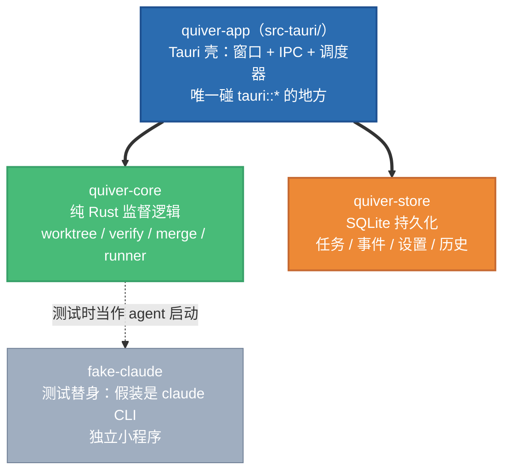
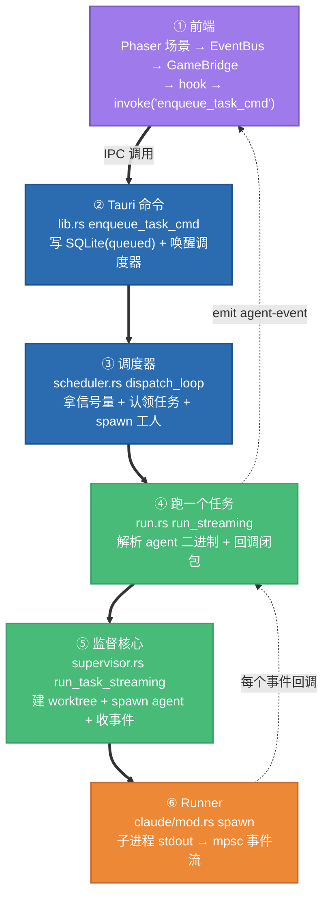
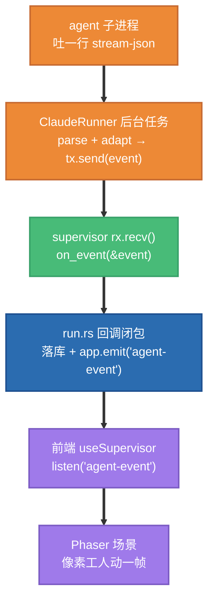

# Quiver 代码导览：跟着一个任务，把 Rust + Tauri 生态串起来

> 这份文档写给 **Rust 新手**（也就是你）。它不讲设计取舍（那是 `DESIGN.md` 的事），
> 而是带你**沿着一条真实主线读代码**，每遇到一个 Rust / Cargo / Tauri 的语法点或生态概念，
> 就地一行解释。读完你应该能回答："用户在界面上点一下，到底有多少 Rust 代码、按什么顺序跑起来？"
>
> 配套的语法速查见 `docs/rust-cheatsheet.md`。引用代码用 `文件:行号` 格式，可以直接点开跳转。

---

## 0. 先建立地图：这个项目由哪些"包"组成

Rust 的编译单元叫 **crate**（一个库或一个可执行程序）。多个 crate 放在一个仓库里、共享一份
依赖锁，就叫 **workspace**。根目录的 `Cargo.toml` 声明了成员：

```toml
[workspace]
members = ["crates/quiver-core", "crates/quiver-store", "crates/fake-claude", "src-tauri"]
```

四个 crate 各司其职，依赖**严格单向**（上层依赖下层，下层绝不反向依赖上层）：



关键认知：
- **`quiver-core` 不认识 Tauri**。它是纯逻辑，可以脱离 GUI 单独测试（`crates/quiver-core/tests/` 下一堆集成测试就是证据）。
- **`src-tauri` 是唯一的"胶水层"**，把 GUI 事件翻译成对 core / store 的调用。
- 在 `src-tauri/Cargo.toml:48-51` 里你能看到这种依赖是用**本地路径**声明的：
  ```toml
  quiver-core = { path = "../crates/quiver-core" }
  quiver-store = { path = "../crates/quiver-store" }
  ```
  `path = ...` 表示"这是同 workspace 的兄弟 crate"，而不是从 crates.io 下载。

> **概念：`crate` vs `mod`（模块）。** crate 是编译/依赖的单位；`mod` 是 crate **内部**的命名空间。
> 比如 `quiver-core` 这个 crate 内部，`crates/quiver-core/src/lib.rs:1-6` 用 `pub mod event;` 等声明了
> 6 个模块。`pub` = 对外可见；不写 `pub` 就是私有。

---

## 1. 主线总览：一次"提交委托"的旅程

我们追踪最有代表性的路径——用户在公告板提交一个任务（"加入公告板"），它最终让一个像素工人动起来。
全程跨越前端 → Tauri 壳 → core，共 6 站：



下面逐站拆。

---

## 2. 第一站 · 前端怎么"喊"后端：Tauri IPC

前端是 React + Phaser。它**绝不直接调 Rust 函数**——两者是两个进程，靠 Tauri 的 **IPC**
（进程间通信）对话。机制只有两个方向：

| 方向 | 前端用 | 后端用 | 本项目的例子 |
|------|--------|--------|--------------|
| 前端 → 后端（请求） | `invoke('命令名', {参数})` | `#[tauri::command]` 函数 | `invoke('enqueue_task_cmd', { prompt, mode })` |
| 后端 → 前端（推送） | `listen('事件名', 回调)` | `app.emit('事件名', payload)` | `agent-event` / `task-updated` |

前端这一侧封装在按领域拆分的 hook 里（没有集中的 service 文件，每个 hook 是一块"IPC 领地"）：
- `frontend/src/hooks/useTaskBoard.ts` — 公告板：`enqueue_task_cmd` / `list_tasks` / `reorder_task` / `cancel_task_cmd`
- `frontend/src/hooks/useSupervisor.ts` — **唯一**订阅 `agent-event` 事件流的地方
- `GameBridge.tsx` 是适配器：把 Phaser 场景发出的命令路由到这些 hook。一条硬规则——**EventBus 永远不碰 Rust，所有 IPC 都待在 hook 里**。

你现在只需记住：前端那一下点击，最终变成一句 `invoke('enqueue_task_cmd', ...)`。
这句话会精确地命中 Rust 侧那个**同名**的 `#[tauri::command]` 函数。

---

## 3. 第二站 · Tauri 命令入口（`src-tauri/src/lib.rs`）

### 3.1 程序怎么启动

入口其实很薄。`src-tauri/src/main.rs:4-14`：

```rust
fn main() {
    let _ = fix_path_env::fix();   // ① 修 PATH（见下）
    quiver_app_lib::run();         // ② 真正的启动逻辑在 lib 里
}
```

> **为什么 `main.rs` 只有一行业务？** Tauri 2 的约定：把逻辑放进**库 crate**（`lib.rs`），
> `main.rs` 只做一个薄壳调用。好处是逻辑可被测试、可复用。`src-tauri/Cargo.toml:18-22` 里
> `[lib] name = "quiver_app_lib"` 就是给这个库起的名字，所以 `main.rs` 写
> `quiver_app_lib::run()`。
>
> **`let _ = ...` 是什么？** Rust 里"忽略一个返回值"的惯用写法。`fix()` 返回一个
> `Result`（可能失败），但这里"尽力而为，失败也不阻塞启动"，所以用 `let _ =` 显式丢弃。
> 如果直接写 `fix_path_env::fix();` 不接收，编译器会警告"你忽略了一个 `#[must_use]` 的 Result"。

真正的启动在 `run()`，`src-tauri/src/lib.rs:304-367`：

```rust
pub fn run() {
    let builder = tauri::Builder::default()
        .plugin(tauri_plugin_dialog::init())   // 挂"选文件夹"对话框插件
        .manage(AppState::default())           // ③ 注册全局共享状态
        .setup(|app| { /* 打开 SQLite，装进 state */ Ok(()) });

    let builder = builder.invoke_handler(tauri::generate_handler![
        pick_project, enqueue_task_cmd, list_tasks, /* …全部命令登记在这 */
    ]);

    builder.run(tauri::generate_context!()).expect("error while running Quiver");
}
```

三个要点：

1. **链式调用 + 构建器模式**：`Builder::default().plugin(..).manage(..).setup(..)` 一路点下去，
   每个方法返回 `self`，所以能串起来。这是 Rust 里极常见的模式。

2. **`generate_handler![ ... ]` 是个宏**（注意 `!`）。它在编译期生成一张"命令名 → 函数"的路由表。
   **你写的每个 `#[tauri::command]` 函数，必须出现在这个列表里，前端才能 `invoke` 到它。**
   忘了登记是新手最常见的"命令找不到"原因。

   > 注意 `src-tauri/src/lib.rs:334-362` 把列表写了**两遍**，用 `#[cfg(debug_assertions)]` /
   > `#[cfg(not(debug_assertions))]` 分别对应 debug / release 构建——因为调试版多注册一个
   > dev-bridge 命令，而 `generate_handler!` 要求一个**字面量**列表，不能运行时拼接。
   > `#[cfg(...)]` 是**条件编译**：括号里条件成立时这段代码才参与编译，否则当它不存在。

3. **`.expect("...")`**：`run()` 返回 `Result`，`expect` 表示"成功就取值，失败就带这句话 panic"。
   在程序最外层用 `expect` 是可以接受的——启动失败本来就该炸。

### 3.2 全局状态怎么共享：`AppState`

多个命令、多个并发工人都要访问同一个项目路径、同一个数据库。Tauri 用 `.manage(x)` 把一个值
登记为全局共享状态，命令函数通过参数 `State<'_, AppState>` 拿到它。看 `src-tauri/src/lib.rs:43-58`：

```rust
#[derive(Default)]
struct AppState {
    project_path: Mutex<Option<PathBuf>>,        // 当前项目（可能没选 → Option）
    store: std::sync::OnceLock<Arc<Store>>,      // SQLite，启动后装一次
    scheduler: Scheduler,                        // 并发队列调度器
}
```

这一小段浓缩了 Rust 并发的三件套，值得逐个认识：

- **`Mutex<T>`（互斥锁）**：多个线程要改同一个值时，必须先 `.lock()` 拿到锁才能碰里面的 `T`。
  这是 Rust"用类型强制你正确加锁"的体现——`project_path` 不加锁你**根本拿不到** `Option<PathBuf>`。
- **`Option<T>`**：要么 `Some(值)` 要么 `None`。Rust 没有 `null`，"可能没有"一律用 `Option` 表达，
  逼你在用之前处理"没有"的情况。这里表示"用户可能还没选项目"。
- **`Arc<T>`（原子引用计数）**：让一个值被**多个所有者共享**。每 `.clone()` 一次，计数 +1；
  全部释放后才真正销毁。并发工人要各持一份 `Store`，就靠 `Arc<Store>`。
- **`OnceLock<T>`**：只能写入一次的格子。`Store` 在 `setup` 阶段（`lib.rs:326-327`）装进去，之后只读。
- **`#[derive(Default)]`**：自动为这个 struct 生成"全 0 / 全空"的默认值，于是 `AppState::default()` 可用。
  `derive` 是 Rust 的"自动实现某个 trait"宏，后面会反复见到。

### 3.3 一个命令函数长什么样

终于到主线那一站。`enqueue_task_cmd`，`src-tauri/src/lib.rs:171-211`（节选 + 行内注释）：

```rust
#[tauri::command]                                      // ← 标记：这是个可被前端 invoke 的命令
async fn enqueue_task_cmd(                              // ← async：这是异步函数
    app: AppHandle,                                    // ← 应用句柄，用来 emit 事件
    state: State<'_, AppState>,                        // ← 注入全局状态
    prompt: String,                                    // ← 前端传来的参数（名字要和 JS 端对上）
    mode: RunMode,                                     // ← 自定义枚举，serde 自动反序列化
) -> Result<TaskRecord, String> {                      // ← 返回 Result：成功给卡片，失败给中文错误串
    let project = current_project(&state)?;            // ① 取当前项目；没选就 ? 提前返回 Err
    let store = state.store()?;                        // ② 取数据库句柄

    let task_id = format!("task-{}", now_ms());        // ③ 生成任务 id
    store.enqueue_task(&NewTask { /* status: "queued" */ })
        .map_err(|e| format!("{e:#}"))?;               // ④ 写库；把库错误转成中文串

    state.scheduler
        .ensure_running(app.clone(), store.clone(), project, max_workers)
        .await;                                        // ⑤ 唤醒调度器（关键！）

    let _ = app.emit_task_update();                    // ⑥ 通知前端"公告板变了，重新拉"
    store.get_task(&task_id)?.ok_or_else(|| "...".into())  // ⑦ 把新卡片返回前端
}
```

这里有几个 Rust 招牌特性，第一次集中出现，务必吃透：

- **`-> Result<TaskRecord, String>`**：Rust 不用异常。函数"可能失败"就返回 `Result<成功类型, 错误类型>`，
  调用方**被强制**处理两种情况。本项目所有命令都约定 `Result<T, String>`，错误就是给前端看的中文串。

- **`?` 运算符**：跟在一个 `Result` 后面。**成功就解包取值继续往下；失败就立刻把这个 `Err` 当作
  整个函数的返回值弹出去。** 它把"层层手动 if 判断错误"压成一个字符。`current_project(&state)?`
  的意思是"拿到项目就继续，没拿到就直接返回那个 Err"。

- **`.map_err(|e| format!("{e:#}"))`**：底层 `store` 抛出的错误类型不是 `String`，而 `?` 要求错误类型
  能转成函数声明的 `String`。`map_err` 就是"把 Err 里的错误换一种类型/措辞"。`|e| ...` 是**闭包**
  （匿名函数），`format!("{e:#}")` 把错误格式化成完整中文描述。

- **`&state` 里的 `&`（借用）**：`current_project(&state)` 传的是 state 的**引用**（借来看一眼），
  而不是把所有权交出去。Rust 所有权规则的核心：一个值默认只有一个所有者；想让别人临时用用，
  就借 `&`（只读）或 `&mut`（可改）。`current_project` 看完 state 就还回来，调用方还能继续用 state。

- **`app.clone()` / `store.clone()`**：注意⑤这里**克隆**了。因为马上要把它们交给一个会"活得比本函数久"的
  后台任务（调度器里的 `tokio::spawn`），不能借引用（借用不能跨越异步任务边界活那么久），
  所以复制一份所有权进去。对 `AppHandle` 和 `Arc<Store>` 来说 clone 很便宜（前者内部是引用计数，
  后者就是 Arc 计数 +1）。

- **`async` / `.await`**：这个函数是异步的。`.ensure_running(...).await` 表示"这一步可能要等
  （比如等锁），等的时候**让出线程**去干别的，完成了再回来"。异步是这个项目并发能力的基础，下一站详谈。

> **一句话小结这一站**：前端 `invoke('enqueue_task_cmd')` → 命中这个函数 → 它把任务写进
> SQLite（状态 `queued`）→ **唤醒调度器** → 立刻回一张卡片给前端闪一下。真正的"跑"还没开始，
> 是调度器的活。

---

## 4. 第三站 · 并发调度器（`src-tauri/src/scheduler.rs`）

这是整个项目 Rust 含金量最高的一块——**用最多 `maxWorkers` 个工人并发跑队列里的任务**。
先看它的状态，`scheduler.rs:52-65`：

```rust
#[derive(Default)]
pub struct Scheduler {
    projects: Mutex<HashMap<String, Arc<ProjectQueue>>>,   // 每个项目一条队列
}

struct ProjectQueue {
    project: PathBuf,
    guard: Arc<GitGuard>,            // 所有工人共享同一把 git 元数据锁
    permits: Arc<Semaphore>,         // 并发名额：信号量，大小 = maxWorkers
    dispatcher_running: Mutex<bool>, // "派工循环是否在跑"的旗标，保证只有一个
}
```

新概念：

- **`Semaphore`（信号量）**：一个"令牌池"。池子里有 `maxWorkers` 个令牌；想干活先 `acquire`
  拿一个令牌，干完释放回去。池空了就得排队等。这就是"最多同时跑 N 个"的实现机制。
- **`HashMap<K, V>`**：哈希表，标准库容器。这里 key 是项目路径，value 是该项目的队列运行时。
- **`tokio::sync::Mutex`** vs 上一站的 **`std::sync::Mutex`**：注意 `scheduler.rs:38` import 的是
  **tokio 版**的 Mutex。区别：tokio 版的 `.lock()` 是 `.await` 异步等待，**等锁时不阻塞线程**；
  标准库版会阻塞整个线程。在异步代码里跨 `.await` 持锁要用 tokio 版。

### 4.1 派工循环：信号量 + 原子认领 + spawn

核心是 `dispatch_loop`，`scheduler.rs:127-172`（精简）：

```rust
async fn dispatch_loop(app: AppHandle, store: Arc<Store>, queue: Arc<ProjectQueue>) {
    loop {
        // ① 等一个空名额（满了就在这 await 排队）
        let permit = queue.permits.clone().acquire_owned().await?;

        // ② 原子地认领下一个 queued 任务（一条 SQL 事务里把它翻成 running）
        let claimed = match store.claim_next_queued(&project_key, now_ms()) {
            Ok(Some(task)) => task,
            Ok(None) => { drop(permit); return; }   // 队列空了 → 还令牌、退出循环
            Err(_)      => { drop(permit); return; }
        };

        // ③ 为这个任务 spawn 一个独立工人（后台异步任务）
        tokio::spawn(async move {
            let _permit = permit;          // 令牌随工人一起活，工人结束才归还
            run_one_task(&app_worker, &store_worker, &guard, task_id, prompt, mode).await;
            let _ = app_worker.emit(TASK_EVENT_CHANNEL, &project_for_worker);  // 通知前端
        });
    }
}
```

逐步理解：

- **`loop { ... }`**：无限循环，直到内部 `return`。
- **`acquire_owned().await`**：拿一个"自有令牌"。`owned` 版本的妙处是这个令牌可以被 `move` 进
  后台任务（③ 里 `let _permit = permit;`），**令牌的生命周期就 = 工人的生命周期**，
  工人一结束令牌自动 drop 归还，下一轮循环就能再认领一个。这是 Rust"用所有权管理资源"的精彩用法。
- **`store.claim_next_queued(...)`** 在**一条 SQL 事务**里把任务从 `queued` 翻成 `running` 并返回它。
  为什么要"原子"？因为可能有多个名额几乎同时空出来、循环转得很快，必须保证**同一个任务不会被认领两次**。
  把"读 + 改"塞进一条事务，数据库帮你保证原子性。
- **`tokio::spawn(async move { ... })`**：启动一个**独立的后台异步任务**（绿色线程），立刻返回，
  循环不等它。于是循环可以马上回到①去认领下一个任务——这就是"并发"。`async move` 的 `move`
  表示"把用到的变量的所有权搬进这个任务"（因为它要独立活下去，不能借外面的引用）。
- **`drop(permit)`**：显式提前释放令牌（队列空时）。`drop` 是 Rust"立刻销毁/释放"的内建函数。

> **一句话小结这一站**：调度器是一个"信号量 + 循环 + spawn"的水泵。名额够就认领一个任务、
> 派一个后台工人去跑、立刻回头认领下一个；名额满就在 `acquire` 那里 await 排队。
> 每个工人最终调用 `run_one_task`——进入下一站。

---

## 5. 第四站 · 跑一个任务的胶水层（`src-tauri/src/run.rs`）

这一层把"任务"翻译成"启动哪个二进制、用什么参数、事件怎么处理"。它**故意不依赖 Tauri 的命令机制**
（只收一个 `&AppHandle` 和 `&Store`），所以既能被命令调，也能被 spawn 出来的工人调。

### 5.1 用枚举表达"运行模式"

`run.rs:41-66`：

```rust
#[derive(Clone, Copy, Debug, Deserialize, PartialEq, Eq)]
#[serde(rename_all = "lowercase")]
pub enum RunMode {
    Simulate,   // 免费默认：跑 fake-claude 假替身
    Real,       // 真的 claude CLI，花订阅额度
}
```

- **`enum`（枚举）+ `match`**：Rust 的枚举是"代数数据类型"，远比 C 的枚举强。配合 `match`
  做穷尽分支处理——少处理一个分支编译器会报错。后面 `resolve_agent_bin` 里就是
  `match mode { Simulate => ..., Real => ... }`。
- **`#[derive(Deserialize)]` + `#[serde(rename_all = "lowercase")]`**：让前端传来的字符串
  `"simulate"` / `"real"`（JSON）能自动变成这个枚举值。**serde** 是 Rust 生态的序列化/反序列化基石库，
  几乎所有 JSON 进出都靠它。`rename_all` 控制大小写映射。
- **`Clone, Copy` 等**：一串自动派生的 trait。`Copy` 表示这个类型小到可以"按位复制"，传递时不必
  操心所有权（像整数那样随便用）。

### 5.2 真正的执行 + 回调闭包

`run_streaming`（`run.rs:145-256`）是核心。它先按模式解析出 agent 二进制和参数，然后调用
core 的 `run_task_streaming`，**传进去一个闭包**作为"每来一个事件就执行"的回调。看 `run.rs:200-216`：

```rust
let outcome = run_task_streaming(
    guard, &task, &agent_bin, &verify, options,
    |event: &AgentEvent| {                         // ← 这就是回调闭包
        if let AgentEventPayload::Result { cost_usd, .. } = &event.payload {
            last_cost = *cost_usd;                 // ① 顺手记下花了多少钱
        }
        if let Some(store) = store {
            persist_event(store, event);           // ② 把事件落库（§11 日志真相源）
        }
        let _ = app.emit(AGENT_EVENT_CHANNEL, event);  // ③ 推给前端 → 像素工人动起来
    },
).await?;
```

这是全篇最值得停留的地方：

- **闭包捕获环境**：这个 `|event| { ... }` 用到了外面的 `last_cost`、`store`、`app`。Rust 闭包能
  "捕获"它身处的环境变量。因为它要改 `last_cost`，所以编译器知道这是个 `FnMut`（可多次调用、可改捕获值）。
  对照 core 那边的签名 `mut on_event: impl FnMut(&AgentEvent) + Send`（`supervisor.rs:169`）——
  正好要求一个"可变、可跨线程"的闭包。**类型系统在编译期就把这份契约对齐了。**
- **`if let Some(x) = ...` / `if let Pattern = ...`**：只关心一种模式时的简写。①处
  `if let AgentEventPayload::Result { cost_usd, .. } = &event.payload` 意思是"如果这个事件正好是
  Result 类型，就把里面的 cost_usd 取出来"，其它类型跳过。`..` 表示"剩下的字段我不关心"。
- **③ `app.emit(AGENT_EVENT_CHANNEL, event)`**：**这就是事件回流前端的那一下**。`AGENT_EVENT_CHANNEL`
  是常量 `"agent-event"`（`run.rs:25`），前端 `useSupervisor.ts` 正 `listen('agent-event')` 等着它。
  每个事件 emit 一次，前端就动一帧。
- **`.await?`**：等这个异步执行完；`?` 把可能的错误向上抛。

执行完后，`run_streaming` 还会合成一个终结事件 `finished`（`run.rs:226-249`），同样落库 + emit，
让前端知道"这个任务画上句号了，结果是 verified / failed / ..."。

### 5.3 解析二进制：和操作系统打交道

`resolve_fake_claude` / `resolve_real_claude`（`run.rs:334-407`）展示了 Rust 怎么干"找文件、读环境变量、
查 PATH"这类系统活：

- `std::env::var("QUIVER_AGENT_BIN")` 读环境变量（返回 `Result`，因为可能没设）。
- `std::env::current_exe()?` 拿到当前可执行文件路径。
- `is_executable`（`run.rs:422-427`）用 Unix 权限位判断一个文件能不能执行：
  ```rust
  use std::os::unix::fs::PermissionsExt;
  m.permissions().mode() & 0o111 != 0   // 任一执行位被置 1
  ```
  `use std::os::unix::...` 是**平台特定 API**；这个项目是 macOS 专属，所以可以放心用 Unix 接口。

> **一句话小结这一站**：run.rs 决定"启动哪个程序、给什么参数"，然后把执行委托给 core，
> 并塞进一个闭包——这个闭包就是"事件落库 + 推前端"的双重出口。

---

## 6. 第五站 · 监督核心（`crates/quiver-core/src/supervisor.rs`）

进入纯逻辑层。`run_task_streaming`（`supervisor.rs:163-284`）是"一个 agent 在隔离 worktree 里
跑完一生"的总指挥。骨架（精简）：

```rust
pub async fn run_task_streaming(
    guard: &GitGuard, task: &TaskSpec, runner_bin: &Path,
    verify: &VerifyCommand, options: RunOptions,
    mut on_event: impl FnMut(&AgentEvent) + Send,     // ← 上一站传进来的回调
) -> anyhow::Result<RunOutcome> {
    guard.disable_auto_gc().await?;                   // ① 加固共享对象库
    let worktree = guard.create(&task.id, ATTEMPT).await?;   // ② 建隔离 worktree

    let runner = ClaudeRunner::new(task.id.clone())
        .with_extra_args(options.extra_args.iter());
    let mut rx = runner.spawn(&task.prompt, worktree.as_path(), runner_bin).await?;  // ③ 启动 agent

    let mut events = Vec::new();
    while let Some(event) = rx.recv().await {          // ④ 收事件流，直到通道关闭
        on_event(&event);                              //    每个事件触发回调（→ emit 前端）
        events.push(event);
    }

    // ⑤ verify-gate：跑测试 → 决定 Verified / VerifyFailed
    // ⑥ 按结果清理 worktree（成功删、保留分支、或失败强删）
    Ok(RunOutcome { task_id, status, events, cleanup, failure, branch })
}
```

新的关键点：

- **`anyhow::Result<T>`**：`anyhow` 是 Rust 应用层最常用的错误处理库。`anyhow::Result<T>` 等价于
  `Result<T, anyhow::Error>`——一种"什么错误都能装进去"的通用错误类型，配 `?` 用极顺手。
  （对照：`run.rs` 命令层用 `Result<T, String>`，因为要给前端中文串；core 内部用 `anyhow`。）
- **`while let Some(event) = rx.recv().await`**：这是**消费一个 channel（通道）**的标准姿势。
  `rx` 是 mpsc 通道的接收端；`recv().await` 等下一条消息；通道被发送端关闭后 `recv()` 返回 `None`，
  循环自然结束。**通道关闭 = agent 跑完了**，这是这套设计里"流结束"的信号。
- **`Vec<AgentEvent>`**：动态数组（可增长）。`events.push(event)` 追加。`Vec::new()` 造空数组。
- **`RunOutcome { ... }`**：函数末尾构造并返回一个结构体（`supervisor.rs:104-116` 定义）。Rust 里
  函数最后一个表达式**不写 `return`、不带分号**，就是返回值。

### 6.1 trait：唯一的"可替换"接口

注意③ 用的是 `ClaudeRunner`，但 supervisor 其实只依赖一个 **trait（特质 / 接口）**——
`AgentRunner`（`crates/quiver-core/src/runner/mod.rs:17-31`）：

```rust
#[async_trait]
pub trait AgentRunner: Send + Sync {
    async fn spawn(&self, prompt: &str, cwd: &Path, bin: &Path) -> Result<Receiver<AgentEvent>>;
    fn kind(&self) -> RunnerKind;
}
```

- **`trait`** 就是"一组方法的契约"，类似别的语言的 interface。任何类型只要 `impl AgentRunner for X`
  实现了这两个方法，就能当 runner 用。将来要接 Codex CLI，只要再写一个 impl，supervisor 一行不用改。
  这就是"§4.1 唯一的 backend-specific 表面"那句注释的含义。
- **`#[async_trait]`**：一个生态宏。Rust 的原生 trait 还不能直接放 `async fn`，社区库 `async-trait`
  用这个宏帮你绕过限制。看到它就知道"这个 trait 里有异步方法"。
- **`: Send + Sync`**：给 trait 加的约束，表示"实现者必须能安全跨线程传递/共享"。因为 runner 要被
  扔进 `tokio::spawn` 的后台任务，编译器要求它线程安全。

### 6.2 最末端：子进程 stdout → 事件流（`runner/claude/mod.rs`）

`ClaudeRunner::spawn`（`runner/claude/mod.rs:64-111`）是整条主线的物理终点——它真正
**启动一个外部进程**并把它的输出变成 Rust 事件流：

```rust
async fn spawn(&self, prompt: &str, cwd: &Path, bin: &Path) -> Result<Receiver<AgentEvent>> {
    let mut command = Command::new(bin);              // ① 构造子进程命令
    command.arg("-p").arg(prompt)
        .arg("--output-format").arg("stream-json")    //    让 agent 吐 NDJSON
        .current_dir(cwd)                             //    cwd = 隔离 worktree
        .stdout(Stdio::piped());                      //    捕获它的标准输出
    apply_env_allowlist(&mut command);                // ② 清空环境，只放行白名单（§9.3 安全）

    let mut child = command.spawn()?;                 // ③ 真正启动子进程
    let stdout = child.stdout.take().context("...")?;

    let (tx, rx) = mpsc::channel::<AgentEvent>(EVENT_CHANNEL_CAP);  // ④ 造一条通道

    tokio::spawn(async move {                         // ⑤ 后台任务：逐行读子进程输出
        let mut lines = BufReader::new(stdout).lines();
        while let Ok(Some(line)) = lines.next_line().await {
            if let Some(raw) = parse_line(&line) {
                let event = adapter.adapt(raw, now_ms());   // 把一行 JSON 转成 AgentEvent
                if tx.send(event).await.is_err() { break; } //   送进通道；接收端没了就停
            }
        }
        let _ = child.wait().await;                   // 收尸，避免僵尸进程；tx 在此 drop → 接收端看到 EOF
    });

    Ok(rx)                                            // ⑥ 立刻把接收端还给 supervisor
}
```

把前面所有概念串起来看：

- **`tokio::process::Command`**：异步版的"启动子进程"。`.arg()` 链式加参数，`.spawn()` 启动。
- **`(tx, rx) = mpsc::channel(...)`**：**mpsc = 多生产者单消费者通道**。`tx` 发送端、`rx` 接收端。
  这是 Rust 里跨任务/线程传数据的主力工具。这里的精妙在于：`spawn` 函数**立刻返回 `rx`**，而真正的
  读取在⑤的后台任务里慢慢进行——于是 supervisor 那边 `while let Some(e) = rx.recv().await` 能
  **一边读一边处理**，实现"实时流式"，而不是等子进程全跑完再一次性拿结果。
- **`tx` drop → EOF**：⑤的后台任务结束时，`tx` 被销毁，接收端 `rx.recv()` 随之返回 `None`——
  这正是上一节 supervisor 那个 `while let` 循环退出的原因。**生产端关通道 = 告诉消费端"没了"**，
  整条流的"结束"语义就建立在 Rust 的所有权/drop 机制上，不需要额外的"结束标志"。
- **`BufReader::new(stdout).lines()`**：把字节流包成带缓冲的逐行读取器。agent 每吐一行 JSON，
  这里读一行 → `parse_line` 解析 → `adapter.adapt` 归一化成 `AgentEvent` → 送进通道。

> **一句话小结这一站**：core 在隔离 worktree 里启动真正的 agent 子进程，用一条 mpsc 通道把它的
> 逐行输出实时变成 `AgentEvent` 流；supervisor 边收边触发回调，回调把事件 emit 给前端。
> 子进程输出完毕 → 通道关闭 → 循环结束 → 跑 verify → 清理 worktree → 返回结果。

---

## 7. 回看全程：数据怎么流回前端

主线是"请求向下，事件向上"。向上这条回流路径，正是像素工人会动的原因：



同时还有第二条更"粗"的回流：每当任务**状态**变化（queued→running→finished），后端 emit 一个
`task-updated`（`scheduler.rs:48`、`lib.rs:298`），前端的公告板/档案库收到后重新 `list_tasks` 拉一遍。
前者（`agent-event`）是细粒度的"工人在干嘛"，后者（`task-updated`）是粗粒度的"公告板该刷新了"。

---

## 8. 怎么动手验证你的理解

光读不够。几个能"看见 Rust 在跑"的动作：

```bash
# 只让 Rust 侧编译过一遍——最快的"我没写错语法"反馈循环
cargo check

# 跑 core 的集成测试，看 worktree / 流式 / 并发 是怎么被测的（很好的阅读材料）
cargo test -p quiver-core

# 看一个最小的"不开 GUI 直接跑一次任务"的例子
cat crates/quiver-core/examples/run_once.rs
cargo run -p quiver-core --example run_once   # 如果它需要参数会提示

# 完整启动应用（会先拉起前端 dev server）
cargo tauri dev
```

推荐的阅读顺序（从易到难，都在主线上）：
1. `crates/quiver-core/src/event.rs`（60 行）——事件长什么样，serde 怎么标注。
2. `crates/quiver-core/src/runner/mod.rs`（31 行）——trait 是什么。
3. `src-tauri/src/lib.rs` 的 `enqueue_task_cmd`——一个命令的全貌。
4. `src-tauri/src/scheduler.rs`——并发三件套（Semaphore / spawn / Arc）。
5. `crates/quiver-core/src/supervisor.rs` + `runner/claude/mod.rs`——通道与流式的精髓。

遇到不认识的符号，先查 `docs/rust-cheatsheet.md`，再回到这里对照真实代码。

---

## 9. 这一趟你应该带走的 10 个概念

| 概念 | 在本项目哪里第一次"非懂不可" |
|------|------------------------------|
| crate / workspace / `mod` / `pub` | 第 0 节，四个 crate 的依赖图 |
| 所有权 / 借用 `&` / `clone` / `move` | `enqueue_task_cmd` 里 `&state` vs `app.clone()` |
| `Result<T,E>` + `?` + `map_err` | 每个 `#[tauri::command]` 的返回与错误转换 |
| `Option<T>` + `if let` | `project_path: Mutex<Option<PathBuf>>` |
| `enum` + `match` | `RunMode` / `FinishStatus` / `AgentEventPayload` |
| `trait` + `impl` + `#[async_trait]` | `AgentRunner` 与 `ClaudeRunner` |
| `async` / `.await` / `tokio::spawn` | 调度器的派工循环 |
| `Arc` / `Mutex` / `Semaphore`（并发） | `AppState` 与 `ProjectQueue` |
| `mpsc` 通道 + drop=EOF | `ClaudeRunner::spawn` ↔ `supervisor` 的收发 |
| serde 序列化（derive / rename / flatten / tag） | `event.rs` 的 `AgentEvent` |

读懂这十个，你就已经站在这个 Rust + Tauri 生态的门里了。
</content>
</invoke>
